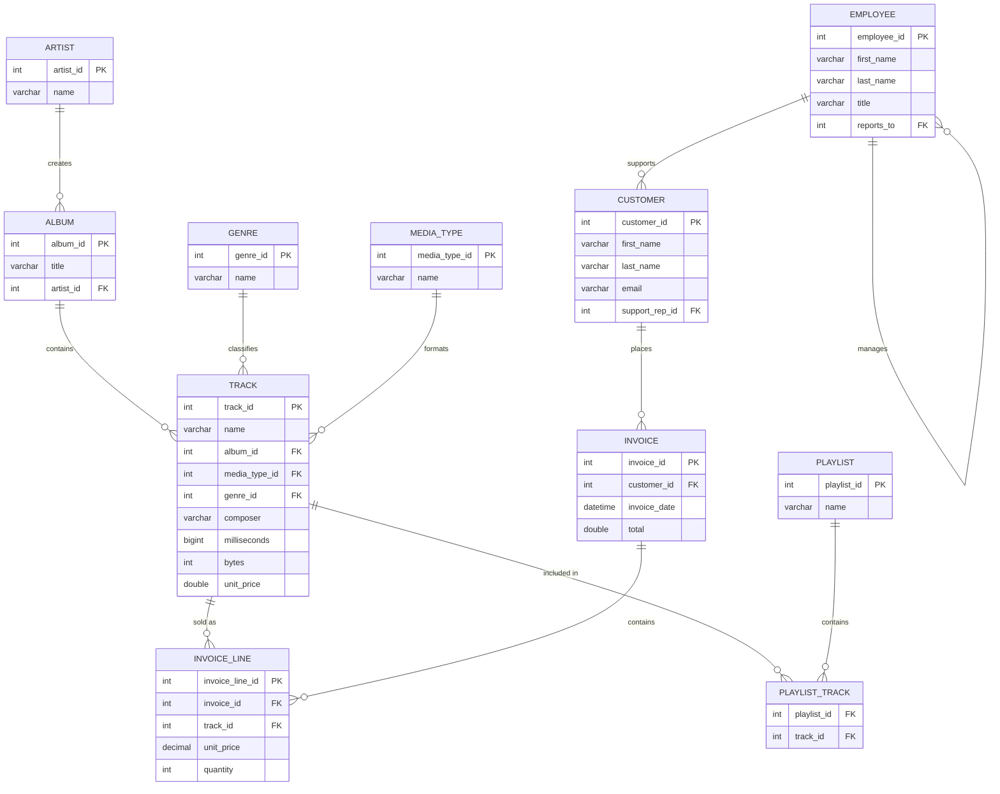
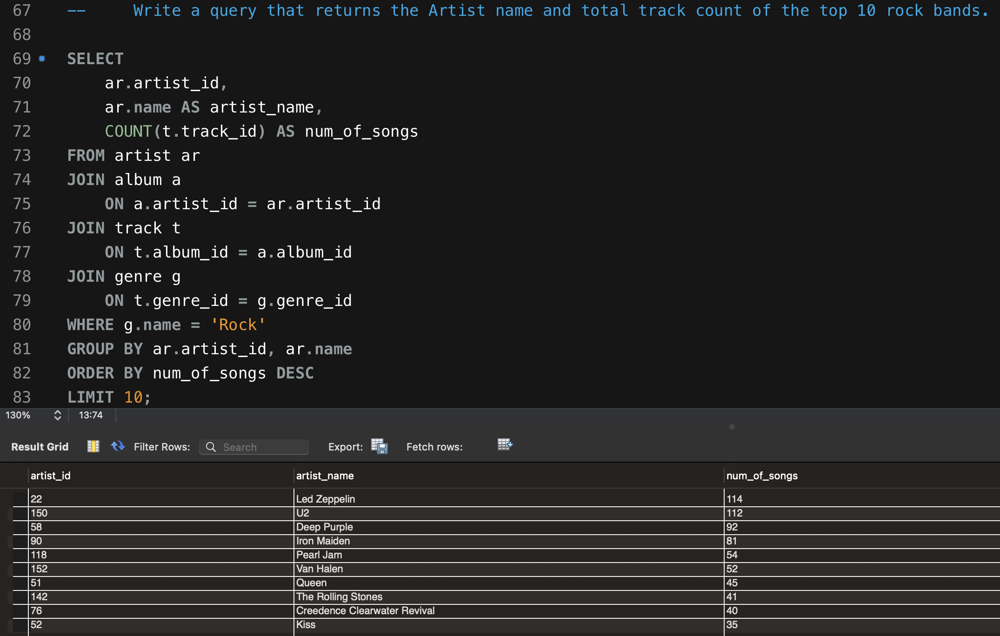
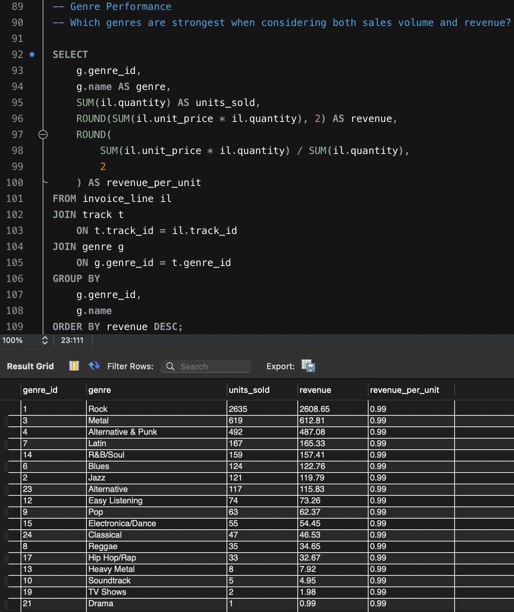

# Music Store Sales Analysis


A SQL-driven business analysis of a digital music store's sales data — built to uncover revenue patterns, customer value, product performance, and geographic demand using MySQL.

This is a practical **Data Analyst project**, designed around real business questions rather than isolated SQL exercises.

---

## Table of Contents

- [Project Overview](#project-overview)
- [Business Objectives](#business-objectives)
- [Tools & Technologies](#tools--technologies)
- [Database Schema](#database-schema)
- [Project Structure](#project-structure)
- [Setup & How to Run](#setup--how-to-run)
- [Business Analysis](#business-analysis)
- [SQL Concepts Demonstrated](#sql-concepts-demonstrated)
- [Example Analysis](#example-analysis)
- [Analytical Approach](#analytical-approach)
- [Sample Query Results](#sample-query-results)
- [Key Business Insights](#key-business-insights)
- [Future Improvements](#future-improvements)
- [Author](#author)
- [License](#license)

---

## Project Overview

This project analyzes a digital music store's sales data using MySQL to uncover patterns in revenue, customer spending, product performance, and geographic demand.

The project is designed as a practical Data Analyst project, focusing on business-oriented questions rather than only basic SQL exercises.

## Business Objectives

The analysis aims to answer questions such as:

- Which customers generate the most revenue?
- How concentrated is revenue among the highest-value customers?
- Which countries are the strongest markets?
- Which music genres generate the most revenue and sales?
- Which artists and songs perform best?
- Which genres are most popular in different countries?
- Who are the highest-spending customers in each country?
- How does monthly revenue change over time?
- How do sales volume and revenue compare across artists and genres?

## Tools & Technologies

- **MySQL 9.7.1
- **SQL** (DDL, DML, analytical queries)
- **MySQL Workbench** / any MySQL-compatible SQL environment
- **CSV datasets** as the raw data source

## Database Schema

The project uses a relational music store database with the following core tables:

| Table | Description |
|---|---|
| `Artist` | Music artists |
| `Album` | Albums linked to artists |
| `Track` | Individual songs linked to albums and genres |
| `Genre` | Music genre classifications |
| `MediaType` | File/format type of each track |
| `Playlist` | User-created playlists |
| `PlaylistTrack` | Junction table linking playlists and tracks |
| `Customer` | Customer details and location |
| `Employee` | Sales support staff assigned to customers |
| `Invoice` | Purchase transactions |
| `InvoiceLine` | Line-item detail for each invoice |

Primary and foreign keys maintain referential integrity across all tables.

### Entity Relationship Diagram



## Project Structure

```text
music-store-analysis/
│
├── Data/
│   └── CSV datasets (album, artist, customer, employee, genre,
│       invoice, invoice_line, media_type, playlist, playlist_track, track)
│
├── images/
│   ├── ERD.png
│   ├── top_rock_artists_query.png
│   └── genre_performance_query.png
│
├── Sql_Files/
│   ├── Music_Player_Data_Tables.sql
│   ├── Data_Loading_Query.sql
│   ├── Alter_Table_Query.sql
│   ├── Music_player_analysis.sql
│   └── Advance_Analysis.sql
│
├── .gitignore
├── LICENSE.txt
└── README.md
```

## Setup & How to Run

**Prerequisites**
- MySQL Server 9.7.1 installed and running
- MySQL Workbench (or CLI access via `mysql`)

**Steps**

1. Clone this repository:
   ```bash
   git clone https://github.com/soumil-714/Music_Store_Analysis.git
   cd music-store-analysis
   ```

2. Log in to MySQL:
   ```bash
   mysql -u root -p
   ```

3. Run the SQL scripts in order:
   ```sql
   SOURCE Sql_Files/Music_Player_Data_Tables.sql;
   SOURCE Sql_Files/Data_Loading_Query.sql;
   SOURCE Sql_Files/Alter_Table_Query.sql;
   SOURCE Sql_Files/Music_player_analysis.sql;
   SOURCE Sql_Files/Advance_Analysis.sql;
   ```

   Or, from the command line:
   ```bash
   mysql -u root -p < Sql_Files/Music_Player_Data_Tables.sql
   mysql -u root -p < Sql_Files/Data_Loading_Query.sql
   mysql -u root -p < Sql_Files/Alter_Table_Query.sql
   mysql -u root -p < Sql_Files/Music_player_analysis.sql
   mysql -u root -p < Sql_Files/Advance_Analysis.sql
   ```

4. **Note on CSV loading:** if using `LOAD DATA INFILE`, ensure `secure_file_priv` is configured correctly and that file paths in `Data_Loading_Query.sql` match your local `Data/` directory.

The workflow is separated into five stages:

```text
Music_Player_Data_Tables.sql   (create tables)
        ↓
Data_Loading_Query.sql         (load CSV data)
        ↓
Alter_Table_Query.sql          (add foreign keys)
        ↓
Music_player_analysis.sql      (core analysis queries)
        ↓
Advance_Analysis.sql           (window functions, CTEs, advanced KPIs)
```

Keeping these stages separate makes the project easier to understand, reproduce, and maintain.

## Business Analysis

### Customer Analysis
- Identify the customers generating the highest revenue.
- Measure the percentage of revenue generated by the top 10 customers.
- Segment customers based on spending.
- Identify customers whose spending is above the average customer spending.
- Find the highest-spending customer in each country.

### Revenue Analysis
- Analyze monthly revenue trends.
- Calculate month-over-month revenue growth.
- Compare revenue across countries.
- Compare average order value across markets.
- Measure revenue concentration among top customers and artists.

### Music/Product Analysis
- Identify the highest-revenue genres.
- Compare units sold and revenue by genre.
- Calculate revenue per unit.
- Identify the highest-revenue artists.
- Identify the highest-revenue songs.
- Rank the top artists within each genre.
- Compare sales volume with revenue to identify different types of high-performing artists.

### Geographic Analysis
- Identify the strongest countries by revenue.
- Compare revenue per customer across countries.
- Identify the most popular genres in each country.
- Rank the top genres by purchase volume for each country.

## SQL Concepts Demonstrated

This project demonstrates practical use of:

- `SELECT`, `WHERE`, `INNER JOIN`
- `GROUP BY`, `HAVING`, `ORDER BY`
- Aggregate functions: `SUM()`, `COUNT()`, `AVG()`
- `CASE` expressions
- Subqueries
- Common Table Expressions (CTEs)
- Window functions: `RANK()`, `ROW_NUMBER()`, `LAG()`, `PARTITION BY`
- Date functions
- Percentage calculations
- Multi-table relational analysis

## Example Analysis

The project uses multiple related tables to analyze revenue and sales at the genre level:

```sql
SELECT
    g.genre_id,
    g.name AS genre,
    SUM(il.unit_price * il.quantity) AS total_revenue,
    SUM(il.quantity) AS units_sold
FROM invoice_line il
JOIN track t
    ON t.track_id = il.track_id
JOIN genre g
    ON g.genre_id = t.genre_id
GROUP BY g.genre_id, g.name
ORDER BY total_revenue DESC;
```

This analysis connects purchased tracks with their genres and compares both revenue and sales volume.

## Analytical Approach

```text
Raw CSV Data
      ↓
Relational Database
      ↓
Data Loading & Relationships
      ↓
Business Questions
      ↓
SQL Analysis
      ↓
KPIs & Comparisons
      ↓
Business Insights
```

The goal is not only to retrieve data, but to use SQL to answer questions that could support decisions around customers, products, markets, and revenue.

## Sample Query Results

A couple of the analysis queries run against the live database, with output:

**Top 10 Rock artists by track count**

```sql
SELECT
    ar.artist_id,
    ar.name AS artist_name,
    COUNT(t.track_id) AS num_of_songs
FROM artist ar
JOIN album a
    ON a.artist_id = ar.artist_id
JOIN track t
    ON t.album_id = a.album_id
JOIN genre g
    ON t.genre_id = g.genre_id
WHERE g.name = 'Rock'
GROUP BY ar.artist_id, ar.name
ORDER BY num_of_songs DESC
LIMIT 10;
```



**Genre performance — units sold, revenue, and revenue per unit**

```sql
SELECT
    g.genre_id,
    g.name AS genre,
    SUM(il.quantity) AS units_sold,
    ROUND(SUM(il.unit_price * il.quantity), 2) AS revenue,
    ROUND(SUM(il.unit_price * il.quantity) / SUM(il.quantity), 2) AS revenue_per_unit
FROM invoice_line il
JOIN track t
    ON t.track_id = il.track_id
JOIN genre g
    ON g.genre_id = t.genre_id
GROUP BY g.genre_id, g.name
ORDER BY revenue DESC;
```



## Key Business Insights

| Insight Area | Finding |
|---|---|
| Top Rock artist by track count | **Led Zeppelin** leads with 114 tracks, followed by U2 (112) and Deep Purple (92) |
| Highest-revenue genre | **Rock** dominates with $2,608.65 in revenue from 2,635 units sold — more than 4x the next closest genre (Metal, $612.81) |
| Revenue per unit | Uniform at **$0.99/unit** across all genres, so genre revenue differences are driven entirely by sales volume, not pricing |
| Volume vs. revenue outliers | Niche genres like Drama, TV Shows, and Soundtrack sell in single digits — low priority for promotion or restocking |
| Top customer(s) by revenue | *TODO — run the customer revenue query and add the top result* |
| Revenue concentration (top 10 customers) | *TODO — add % of total revenue from `Advance_Analysis.sql`* |
| Strongest market / country | *TODO — add top country by revenue* |
| Monthly revenue trend | *TODO — add MoM growth figure* |

> The genre and artist rows above are filled in from actual query output (see [Sample Query Results](#sample-query-results)). Remaining rows are still placeholders — add the real figures as you run the customer, geography, and time-based queries in `Music_player_analysis.sql` / `Advance_Analysis.sql`.

## Future Improvements

- More detailed customer behavior analysis
- Data-driven customer segmentation
- Customer retention analysis
- Cohort analysis
- Additional time-based revenue analysis
- More detailed product performance analysis
- Automation of recurring analysis (e.g., scheduled reporting, dashboard integration)
- Visualization layer (Power BI / Tableau / Python) built on top of the SQL analysis

## Author

**Soumil Jain**

A practical SQL and Data Analytics project focused on business-oriented analysis using MySQL.

📫 *Add your contact info here — LinkedIn, GitHub, portfolio site, or email — so reviewers can reach out.*

## License

This project is open source and available under the [MIT License](LICENSE.txt).