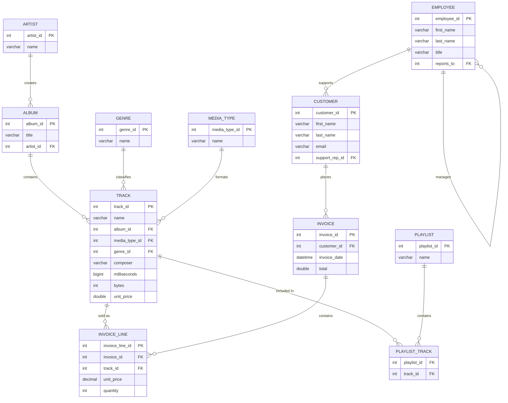

```mermaid
erDiagram
    ARTIST ||--o{ ALBUM : "creates"
    ALBUM ||--o{ TRACK : "contains"
    GENRE ||--o{ TRACK : "classifies"
    MEDIA_TYPE ||--o{ TRACK : "formats"
    TRACK ||--o{ INVOICE_LINE : "sold as"
    TRACK ||--o{ PLAYLIST_TRACK : "included in"
    PLAYLIST ||--o{ PLAYLIST_TRACK : "contains"
    CUSTOMER ||--o{ INVOICE : "places"
    INVOICE ||--o{ INVOICE_LINE : "contains"
    EMPLOYEE ||--o{ CUSTOMER : "supports"
    EMPLOYEE ||--o{ EMPLOYEE : "manages"

    ARTIST {
        int artist_id PK
        varchar name
    }
    ALBUM {
        int album_id PK
        varchar title
        int artist_id FK
    }
    GENRE {
        int genre_id PK
        varchar name
    }
    MEDIA_TYPE {
        int media_type_id PK
        varchar name
    }
    TRACK {
        int track_id PK
        varchar name
        int album_id FK
        int media_type_id FK
        int genre_id FK
        varchar composer
        bigint milliseconds
        int bytes
        double unit_price
    }
    PLAYLIST {
        int playlist_id PK
        varchar name
    }
    PLAYLIST_TRACK {
        int playlist_id FK
        int track_id FK
    }
    CUSTOMER {
        int customer_id PK
        varchar first_name
        varchar last_name
        varchar email
        int support_rep_id FK
    }
    EMPLOYEE {
        int employee_id PK
        varchar first_name
        varchar last_name
        varchar title
        int reports_to FK
    }
    INVOICE {
        int invoice_id PK
        int customer_id FK
        datetime invoice_date
        double total
    }
    INVOICE_LINE {
        int invoice_line_id PK
        int invoice_id FK
        int track_id FK
        decimal unit_price
        int quantity
    }
```