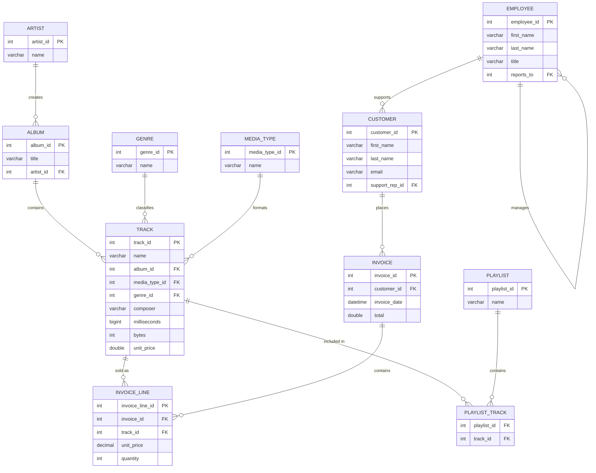

  *Figure 1: Full relational schema — 11 tables covering artists, tracks, customers, invoices, and playlists, connected via primary/foreign keys.*

<!--  -->
<!--  -->

*Figure 2: Output of the Rock-artist ranking query — Led Zeppelin leads with 114 tracks, followed by U2 (112) and Deep Purple (92).*

<!--  -->
<!--  -->

*Figure 3: Revenue and units sold by genre — Rock dominates at $2,608.65 from 2,635 units, over 4x the next-highest genre.*